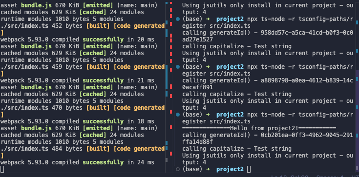

# Project References - NodeJS examples

## Setup 

This is an example to setup project references in NodeJS environment with minimal setup 

`library` - contains two exported functions each one using a different library only install in `library`

`project1` - doesn't have any of the npm packages installed, it only imports from library , same goes for `project2`

`cd` in each of the directories and `npm ci`.

### TypeScript Path Mapping

TypeScript’s own path mapping feature can be used to simplify imports during development, but we must remember that TypeScript path aliases **are not respected by Node.js** at runtime. To address this, we need to integrate a build tool or module bundler that supports path resolutions based on TypeScript’s configuration, such as Webpack or others.

#### Using regular `tsc` compilation in watch mode and `ts-node` & `tsconfig/paths`

`project1` uses the minimal setup of `ts-node` with `tsconfig/paths`

To test out the behavior, open 3 terminals:

- `cd library && npm run watch`
- `cd project1 && npm run watch`
- `cd project1 && npm run start`

#### Using regular `webpack` compilation in watch mode and `ts-node` & `tsconfig/paths`

`project2` uses `webpack` for build and listening to incremental changes +  `ts-node` with `tsconfig/paths`

To test out the behavior, open 3 terminals:

- `cd library && npm run watch`
- `cd project2 && npm run watch`
- `cd project2 && npm run start`

 

**Conclusion**

This is a very basic example and proof that path aliases work as intended with a few additional tools. However, handling path aliases can vary significantly when using other frameworks like Express, NestJS, or integrating with different build tools, each of which may resolve paths or manage dependencies differently.

Frameworks like Express or NestJS, and tools like Babel, Rollup, or different configurations of TypeScript and Webpack, might have their own mechanisms for handling module resolution, aliasing, and compiling. This can lead to discrepancies in how paths are managed across different environments or build processes, necessitating specific configurations or plugins to align with the expected behavior in each context.